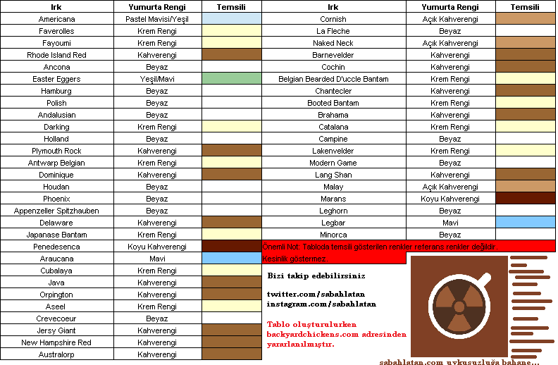

Okumayı sevenler için bu yazımızda tavuğun **(**_**Gallus gallus domesticus**_**)** yumurta rengi, rengi belirleyen faktörler ve maddeler, durumun genetik yapısı, yumurta rengi ile kalitede bir linkage var mı gibi konulardan bahsedeceğiz. Biraz genetikten bahsedeceğiz, birazda genel birkaç bilgiden. Kısa bir paragraf yazısını bilgilerle dolduruyoruz. Baştan biz senine anlaşalım. Sonra bozuşmayalım neden yazı uzun diye. Bu yazı öyle iki satır kaynakçasız [bilgi](https://sabahlatan.com/blog/kategori/genel-kultur/)den oluşmuyor. Eğer ki sadece kahverengi yumurta ile beyaz yumurta arasında bir fark var mı diye buraya geldiysen yanlış yerdesin. Ama ben cevabı vereyim önemli bir fark yok. Hatta tıpatıp aynı. Eğer ki sadece nasıl kahverengi oluyor diye cevap aramaya geldiysen cevabını vereyim yumurta oluşumunda kabuğa vücut metabolizmasının yan ürünlerinin pigmentleri nüfuz ediyor. Eğer ki okumaya devam etmek istiyorsan lütfen aşağıya doğru in.

### Yumurta Renginde Çevrenin Etkisi

Kimi tavuklar beyaz, kimi tavuklar kahverengi yumurtlar. Hatta kahverengi tavuk yumurtalarını organik köy tavuğu yumurtası (!) diye satmaya çalışanlar yok değildir. Tavuk demişken _**Gallus gallus**_ kızıl orman kuşudur ve evcil tavuğun öncülüdür. Hatta bununla ilgili bir diagram içeren resim buldum onuda alt kısımda paylaşırım. Yumurtadaki rengi belirleyen fiziki durum **genetik**tir. Çevrenin bir etkisi ile yumurta renginin değişmesi arasında bir bağlantı var mıdır bu durumu bilmiyorum.

Demek istediğim şey bir canlının fenotipine sadece genetik mekanizma etki etmez. Örnek vermek gerekirse çuha çiçeği **(**_**Primula**_ **spp.)** corolla kısmı 25-35 °C de beyaz renk alırken 15-25 °C de kırmızı renk almaktadır. Ancak petal kısmının dip kısmı sarı rengini korumaktadır. Çevre etkisi tabiki renk gibi bir konuda sınırlı değildir. İnsan **(**_**Homo sapiens)**_ tek yumurta ikizlerini ele alalım. Babadan gelen sperm annedeki yumurtayı döller ve zigot oluşur. İşte bu döllenmiş yumurta, ilk zigottan sonra ikiye ayrılır ve ikiye ayrılan bu iki kısım ayrı bireyler olarak gelişir. Doğumdan sonra büyüyen ve yetişkin olan bu iki birey aynı genetiğe sahiptir.

### Tek Yumurta İkizlerinin Farklı Çevrelerde Hikayeleri

Fazla hızlı gittiğimizi biliyorum. Hadi geri dönelim ve bu iki bireyin çocukluklarını ele alalım. İki bireyin ten rengi, tırnakları vs. genetik olarak aynı oldukları için aynıdır ve şuan aynı çevrededirler. Birazdan farklı çevrelere gidecekler ve belirli bir sürenin sonunda şuan bulundukları eve döneceklerdir. Ahmet ve Mehmet ismi verilmiş bu tek yumurta ikizlerinden Ahmet son derece kötü bir okula gidiyor olsun. Mehmet ise idealist bir okula gidiyor olsun.

Ahmet okulunda iyi eğitim alamadı. Kötü yetiştirme koşullarında sigaraya, alkole ve uyuşturucuya başladı. Bunlar yetmezmiş gibi kötü beslenme alışkanlıkları edindi. 10 yıl Afrikada elmas madenlerinde kölelik yaparak yaşamaya çalıştı. 10. yılın sonunda evine döndü.

Mehmet idealist okulunda kaliteli öğretmenleri eşliğinde iyi bir eğitim aldı. Spor ile uğraştı. Arkadaş çevresi okulun ilgisi ile bağlantılıydı. Kötü bir alışkanlığı yoktu. İsviçrede anadal ve yandal ile birlikte lisans eğitimini tamamladı. Londrada yüksek lisans Amerikanın Boston eyaletinde MIT de doktorasını tamamladı. 10 yıl Norveçte akademisyenlik yaptı ve şuan devasa bir şirkette arge müdürü. 10. yılın sonunda evine ziyarete gitti.

### Ahmet ve Mehmeti İnceleyelim

Ahmet ve Mehmet yanyana duruyor. İkisi de bize bakıyor. İkiside genetik olarak aynı. Ahmet Afrika sıcağında esmerleşmiş, kötü alışkanlıktan dolayı diş etleri çürümüş, deri rengi solmuş, gözaltları çökmüş, tırnakları dökülmüş, ayakta zor durar bir vaziyette. Eğitimi kötü. Bu arada uyuşturucunun zararları konusunda bir yazımız olabilir. Mehmet beyaz tenini karşımızda krem ile nemlendiriyor. Tırnakları törpülü. Vücudu fit. Dik duruşu ve bize bakışları ile güven vermektedir. Sağlığı yerinde. Her ikiside sağlık check-up larını bize uzatıyor. Ahmetin berbat ötesi bir sağlığa sahip olduğunu, Mehmetin ise iyi bir sağlığa sahip olduğunu öğreniyoruz. İşte iki farklı çevrede yetişmiş aynı genotipe sahip bireyler. Çevrenin etkisi insan üzerinde bu kadar bellidir.

### Peki Yumurta Rengi Hangi Tavukta Nasıldır?

Hadi gelin birazda kümesimize girelim. Bir sürü tavuğumuz var. Acaba hangisi kahverengi yumurtlar da hangisi beyaz yumurtlar? Markör olarak kulak lobları beyaz olan tavuklar çoğu zaman beyaz yumurta vermektedir. Leghorn tavuklarının kulak lobları beyazdır ve yumurta rengi beyaz olur.

Gördüğünüz üzere ikinci resimde tavuğun kulak lobu kırmızıdır. Bu tavuğun yumurta rengi genellikle kahverengidir. Tavuğun kulak lobunun rengi ile belirleyici bir markör oluşturabiliriz. Bu markörleri nerede kullanabiliriz? Bu markörler genellikle ıslahta kullanılmaktadır. Aşağıda ise çeşitli tavuk ırkları ve ürün olarak verdiği yumurta kabuğu renkleri ile ilgili bir tablo vardır. Tablo oluşturulurken üzerinde yazan kaynak olarak belirttiğim ilgili sitedeki resimden yararlanılmıştır, ki yumurtaların rengi aşığıdaki tabloda yazdığı gibi her yerde aynıdır. Ancak daha ayrıntılı bilgi isteyen kümes hayvanı uzmanı **Katie Thear** ın kitaplarına göz gezdirebilir.

### İşin Genetik Kısmı

Renk genetik olarak kalitatif bir özelliktir. Bu durumda bahsi geçen fiziki özellikler tek bir gen tarafından yönetildiği varsayıldığında şu durumda ortada bir pleitropi olduğunu söyleyebilir miyiz? Pleotropi basitçe bir genin birden fazla fenotipik özelliği etkilemesidir olarak tanımlanabilir. Birde antagonistik pleitropi vardır ki buda bir genin hayatın erken dönemlerinde olumlu etki yaparken ileri ki dönemlerinde olumsuz etki yapmasıdır. Konumuzla antagonistik pleitropinin pek alakası yok sanırım.

Siyam kedisinin **(**_**Felis catus**_**)** yüz kısmı siyah tüylere sahip iken gövde beyaz tüylere sahiptir. Ancak bu iki özellikte tek bir allel gen tarafından idare edilmektedir. Yani lokusta bulunan tek bir gen 2 ve 2 den fazla özelliği etkilemektedir. Haseki küspesinde **(**_**Aquilegia vulgaris**_**)** tek bir gen gövde uzunluğunu, korolla rengini, bin tane ağırlığını, yaprakta antosiyanin oluşumunu idare eder. Tavuklarda ise kulak lobu rengini ve yumurta kabuğunun iç/dış rengini tek bir gen idare etmektedir. İç dış dedik çünkü yumurta rengine göre farklılıklarda oluşuyor. İsterseniz bir kahve yenileyin ve burada okuduğunuz terimlerin birkaçını araştırmaya kahvenizi yeniledikten sonra devam edin.

### Peki Hangi Maddeler Yumurtanın Kabuğuna Renk Verir?

Michigan State Üniversitesinde yayımlanan bir makalede yumurtanın oluşumunun 26 saat sürdüğü, kabuk oluşumunun tamamlanması ise 20 saat sürdüğü belirtiliyor. Yumurtalıktan geçen yumurtaya oosiyanin adlı bir safra yan ürünü olan pigment nüfuz eder ve yumurtanın içi ve dışı da mavi renk olmaktadır. Kahverengi yumurtlayan tavuklarda ise durum biraz farklıdır. Kabuğun oluşum evresine geç kalan protoporfirin pigmentleri kabuğun sadece dış yüzeyine nüfuz etmektedir. Bu nedenle yumurta rengi ile ilgili olarak kabuğun sadece dış yüzeyi kahverengi kalırken iç yüzeyi beyaz olmaktadır.

#### Porfirin

Peki protoporfrin nedir? Porphyra yunanca mor anlamına gelir ve porfirin buradan türemiştir. 4 adet metin grubunun meten köprüleri ile oluşturdukları pirol halklarından oluşurlar. Doğada I ve III sınıf altında toplanırlar. Protoporfirinler endojendir. Kan hücrelerinin yıkımı sırasında yan ürün olarak elde edilirler.

#### Oocyanin

Mavi kabuk rengine neden olan pigment oosiyanindir. Bu özelliği idare eden otozomal dominant genin ismi ise oocyan (O) olarak adlandırılır. 1 kromozomun kısa kolu ile eşleşmektedir. Homozigot tavuklar tarafından üretilen yumurtalar heterozigotlardan daha koyu mavidir. Otozom cinsiyet dışındaki kalıtımı gonozom ise X ve Y kromozomları ile cinsiyet alıtımını ifade etmektedir. **Profesör Punnet** 1933 yılında bu genin dominant bir özellik olduğunu göstermiştir.

### Peki Kabuk Rengi Farklı Olunca Yumurtalar da mı Farklı Oluyor?

Shafey ve ark. belirttiğine göre kuluçkalık yumurta kabuk rengi açıktan koyuya doğru arttıkça döllülük oranıda artıyor fakat istatistik bir farklılık bulunmuyor. **İllionis Üniversitesinin** uzantılar bölümünde yumurtalar hakkında yazılmış yazılara baktığımızda ise kahverengi yumurta ile beyaz yumurta arasında bir farklılık yok. Her ne olursa olsun besin içeriği, çırpılma ve pişme kalitesi kahverengi ve beyaz yumurtada aynıdır.

### Son Sözler

Gelelim yumurtanın dikkat çekiçi birkaç özelliğine. Yukarıda bahsettiğim kaynakta kolayca soyulmayan yumurtaların taze olduğu ve pişirmeden önce birkaç gün bekletilen yumurtaların karbondioksit kaybederek soyulmayı kolaylaştırdığı söylemektedir. Yani ne kadar zor soyulursa o kadar iyi demekmiş. Yumurta **riboflavin (B2)** vitamini açısından zengindir. Sarısı ise **A** vitamini kaynağıdır. Yazının başında belirttiğim o **diagramı** paylaşayım. Geldik yazımızın sonuna. Yazımızı okuduğunuz için teşekkür ederiz. Altta yazıyı yazarken yararlandığım kaynakları bulabilirsiniz. Yazıda yanlış bir bilgi ile karşılaşırsanız veya tartışmak istediğiniz bir kısım varsa yazmaktan çekinmeyin arkadaşlar.

Japon bıldırcını _(Cotrinix japonica)_ soyu neredeyse tehtid altında olan bir türdür ve yanlızca 90 g ağırlığındadır.

  
**Kaynaklar**  
https://evrimagaci.org/antagonistik-pleiotropi-6818  
https://www.canlibilimi.com/pleiotropi-nedir/  
http://www.tipterimlerisozlugu.com/protoporphyrin.html  
http://extension.illinois.edu/eggs/res04-consumer.html  
https://www.canr.msu.edu/news/why\_are\_chicken\_eggs\_different\_colors  
http://www.virology.ws/2013/09/11/a-retrovirus-makes-chicken-eggshells-blue/  
https://evrimagaci.org/beyaz-ve-kahverengi-tavuk-yumurtalari-arasindaki-fark-nedir-2624

R**esim Kaynakça**  
asilclub.spruz.com  
agriculturalwithdrlindsay.com  
acenatural.com  
ubilio.com
