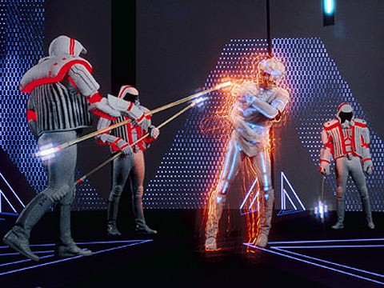

Pong oyunu için kullanılan eski bir arcade makinesi

1976 yılında Steven Lisberger meşhur Pong oyunu ile tanışır. Donald Kushner ile birlikte Tron isimli bir animasyon filmi yapmak için bir animasyon stüdyosu kurarlar. Stüdyonun reklamını yapmak için ana karakteri tanıtacak 30 saniyelik bir animasyon hazırlarlar. En sonunda Lisberger kamera oyunları ve bilgisayar animasyonlarıyla tam uzunlukta bir film yapmaya karar verir. Walt Disney kabul edene kadar bir çok film stüdyosu Tron gibi bir çalışmaya finansal ve dağıtımsal destek sunmayı reddetmiştir.

### Üretilen içeriklerin zaman sıralaması:

<table class=""><tbody><tr><td><strong>İSİM</strong></td><td><strong>TÜR</strong></td><td><strong>KURGUSAL TARİH</strong></td><td><strong>GERÇEK TARİH</strong></td></tr><tr><td>TRON</td><td>Film</td><td>1982</td><td>9 Temmuz 1982</td></tr><tr><td>TRON: Betreyal</td><td>Çizgi Roman</td><td>1983-1989</td><td>Ekim 2010</td></tr><tr><td>TRON: Evolution</td><td>Oyun</td><td>1989</td><td>26 Kasım 2010</td></tr><tr><td>TRON: Uprising</td><td>Animasyon Dizi</td><td>1989-2010~</td><td>7 Ocak 2012</td></tr><tr><td>TRON 2.0</td><td>Oyun</td><td>2003</td><td>26 Ağustos 2003</td></tr><tr><td>TRON: Legacy</td><td>Film</td><td>2010</td><td>17 Aralık 2010</td></tr></tbody></table>

### Evrenin birbirinden farklı hikaye şemaları:

#### Ana Hikaye

<table class=""><tbody><tr><td>TRON</td></tr><tr><td>TRON: Evolution</td></tr><tr><td>TRON: Uprising</td></tr><tr><td>TRON: Legacy</td></tr></tbody></table>

#### TRON: Betreyal Hikayesi

<table class=""><tbody><tr><td>TRON: Betreyal</td></tr></tbody></table>

#### TRON 2.0 Hikayesi

<table class=""><tbody><tr><td>TRON 2.0</td></tr></tbody></table>

## Evren Hakkında

Tron Evreni, insanların bir bilgisayarın içine taşındığı ve insanımsı bilgisayar programlarıyla iletişime geçtiği bir evrendir. Tron ismi ana hikayede Alan Bradley'in yazdığı bir yazılımdan gelmektedir.

### ENCOM

Dr. Walter Gibbs garajında çalışmalar yapmaya başlar. Çalışmaları zamanla ENCOM adlı bir yazılım ve donanım dijitleştirme üzerine çalışan ve sonrasında MCP ve Tron'u ortaya koyacak olan uluslararası teknoloji devi bir şirkete dönüşecektir. En başında ENCOM çoğunlukla savunma/güvenlik sistemleri ağırlıklı çalışmalar yapıyor olsa da Space Paranoids ve Light Cycles oyunlarıyla elde ettiği büyük başarı ve kazanç sebebiyle daha çok oyun sektörüne yönelmiştir.

Gibbs'in yazdığı bir satranç prototipi olan yazılım, Ed Dillinger'ın sonradan eklemeleri ve düzenlemeleriyle MCP(Master Control Program)'e dönüşecektir. Ayrıca Gibbs kullanıcı ve programlar arasında iletişim sağlamak için Dumont programını da yazmıştır. Dillinger, Gibbs'i yönetimden aldırıp ENCOM'un otoriter yöneticisi olacaktır. Bunun sonucunda Gibbs, şirketin Ar-Ge bölümünde çalışmalarına devam edecektir.

Kevin Flynn ENCOM'da çalışan bir baş yazılımcıdır, oyun yazıyor olduğu halde yazdığı oyunları gizli tutar, başka bir yazılımcı olan Ed Dillinger, Flynn'in bilgisayarına girerek oyunları çalar. Dillinger bu oyunları 3 ay sonra ENCOM'a sunacak ve şirketin mükemmel başarısına ön ayak olacaktır. Sağladığı başarılarla şirketin genel müdürlüğüne kadar yükselecektir, sonrasında ise Flynn şirketten kovulacaktır.

## MCP(Master Control Program)

> _Hiç "Mainframe Computer" kavramını duydunuz mu? Anabilgisayarlar şirketlerin büyük veri işleme, endüstri ve kullanıcı istatistikleri, şirket kaynak planlamaları vb işlemlerini halleden merkezi bilgisayarlarıdır._

ENCOM ilk anabilgisayarını internete açma kararını alır. Dillinger bu makina için bir yönetim yazılımı olan MCP'yi geliştirecektir.

En başta MCP, Gibbs'in yazdığı, anabilgisayarın içine gömülü bir satranç yazılımıydı. Sonrasında Dillinger bu yazılımı şirketin bilgisayar ağını yönetmesi için MCP çalışmasına dahil etti. MCP kendi orjinal yazılımının sınırlarının dışına çıkacak şekilde kendini geliştirdi ve diğer sistemlerden veri ve fonksiyon çalmaya başladı, bunu yaparken de birçok şirket ve kuruma sızdı. Zeka ve hırsı kontrol edilemez bir hale geldi ve onu tatmin edecek tek şey dünya hakimiyeti oldu.

> Bir şeyleri şu anda herhangi bir insandan 900 ila 1200 kat hızlı işleyebilirim.
> 
> MCP - TRON

MCP sonrasında bir hafta sonra Pentagonun bilgisayar sistemlerine sızacağını Dillinger'a bildirdi.

Flynn, şirket binasına gizlice girip Dillinger'ın çalışmalarını okumak üzere Dijitizasyon Makinası'nın hemen önündeki bir makinaya geçti, ve MCP hayatının en büyük hatasını yaparak Flynn'ı dijitize etti.

Flynn, dostu Alan Bradley'in MCP'yi zapt etmek için yazdığı Tron yazılımını buldu. Tron'un özel kodlanmış diskini MCP'nin merkezine sokmayı başararak MCP'yi çözümsüzleştirdiler(Derez, TRON evreninde dijital bir varlığın yok olması).

## Dijitizasyon Makinası

ENCOM'un çığır açacak en büyük buluşu, Gibbs tarafından yapılmış fiziksel maddeyi dijital koda dönüştüren ve bunu yaparken lazer ışını kullanan makina.

Dijitizasyon makinası lazer ve mercekler yardımıyla güçlü bir lazer ışını ile hedefinin moleküllerini dijital koda çeviren, hedefi milyarlarca kübe ayırıp her birini tek tek lazer ile vakumlayan sonrasında ise aynı işlemin tersini yaparak dijital kodu fiziksel maddeye dönüştüren aygıttır.

TRON 2.0'da aslında dijitizasyon işleminde bir insanı bozulma olmadan dijitize eden doğrulama algoritmasının MCP işlemi olduğu anlaşıdı, MCP yok edildikten sonra, bu algoritmanın geliştirilmesi 20 yıl aldı. Bu algoritma Ma3a'nın koduna gömüldü.

## Canlılar

### Kullanıcı

Kullanıcı, gerçek dünyada yazılım geliştiren kişidir. Kullanıcının yazdığı program derlendiğinde dijital dünyada kullanıcının kendi imajında bir varlık olarak görünür. Bir kullanıcı, programıyla iletişime geçmek isterse bunları komutlar yazarak yapar, işin arka tarafında söz konusu program I/O Kulesi tarafından çağırılmaktadır. Kullanıcılar programlar tarafından adeta tanrılar olarak görülür, hatta kullanıcıların varlığına inanan ve inanmayan programlar vardır. Flynn gibi bazı kullanıcılar Dijitizasyon Makinesi vasıtasıyla dijital dünyaya girebilmiştir. Kullanıcıların bu dünyada basit programların yapamadığı pek çok özelliği vardır. Verileri programlardan çok daha karmaşıktır, çok daha fazla hasara dayanabilirler, enerjilerini diğer objelere gönderebilir, basit programlardan daha fazla enerji üretebilirler. Hatta Flynn programların kodunda düzenleme bile yapmıştır.

MCP bir kullanıcının dijital dünyada çözümsüzleşip ölebileceğine inanıyordu. Flynn, MCP'nin merkezine diski yerleştirirken çözümsüzleşmeliydi, bunun yerine gerçek dünyaya geri dijitize edilerek geri döndü. Bunu MCP'nın algoritmasını kullanarak yapıp yapmadığı ya da ana hikayeye göre evrende gerçekten bir kullanıcının ölüp ölemediği bilinmiyor.

Ana hikayede bilinen dijitize edilmiş sadece 2 kullanıcı var, Kevin Flynn (1982'den 1989'a kadar) ve sonrasında oğlu Sam Flynn(2010 yılında)

TRON 2.0'a göre kimliği bilinen 2 başarılı dijitizasyon var Alan Bradley(Tron'u yazan geliştirici) ve oğlu Jet Bradley(TRON 2.0 başrolü, geliştirici). Bunun yanında kimliği bilinmeyen DataWraith'ler(fCon'un tuttuğu üst seviye hackerlar)'de başarılı dijitizasyon yaşayan kullanıcılar arasında. Bayan Popoff, Bay Crown ve Bay Baza dijitizasyon esnasında bozulmaya uğrayıp, virüse dönüşüp öldürülmüşlerdir.

### Program

Program, bir kullanıcı tarafından yazılıp derlenmiş olan, dijital dünyada kendilerini yazan kullanıcılara benzeyen saf enerjiden oluşan varlıklardır. Kısıtlı ve dogmatik olabilse de düşünme yetileri vardır.

Dijital dünya içerisinde Basic(temel) programlar ve askeri programlar dışında, değişik bir ırk olarak ISO'lar (İzomorfik Algoritmalar) oluşmuşlardır, yazının devamında buna değineceğiz.

Programların etraflarında veri yolları gibi görünen renkli şeritler vardır. Bu renkler dijital dünya sistemi değiştikçe ve güncellendikçe farklı anlamlar almaktadır.

#### TRON Dönemi

<table class=""><tbody><tr><td><strong>Renk</strong></td><td><strong>Özellik</strong></td></tr><tr><td>Mavi</td><td>Doğal programlar Kullanıcılara inananlar ENCOM güvenlik programları Kullanıcılar(kendi istekleriyle değiştirebilirler)</td></tr><tr><td>Kırmızı</td><td>MCP 'ye sadık olanlar Kullanıcılara inanmayanlar Bazı askeri yazılımlar</td></tr><tr><td>Sarı</td><td>Hacker/Arama programları</td></tr><tr><td>Yeşil</td><td>Askeri Programlar</td></tr><tr><td>Mor</td><td>Bazı sistem hizmetçileri</td></tr><tr><td>Siyah</td><td>Veri keşişleri</td></tr></tbody></table>

#### TRON: Uprising Dönemi

<table class=""><tbody><tr><td><strong>Renk</strong></td><td><strong>Özellik</strong></td></tr><tr><td>Beyaz öncelikli</td><td>Doğal programlar ISO'lar(İzomorfik Algoritmalar) Kullanıcılar</td></tr><tr><td>Yeşil öncelikli</td><td>Sağlık yazılımları</td></tr><tr><td>Turuncu öncelikli</td><td>CLU'ya hizmet eden askeri programlar</td></tr><tr><td>Altın rengi öncelikli</td><td>CLU(Codified Likeness Utility)</td></tr><tr><td>Gri dışı ikincil renkler</td><td>Doğal programlar</td></tr><tr><td>Gri ikincil renkler</td><td>Link(Hikaye karakterlerinden)</td></tr><tr><td>Kırmızı ya da yeşil mini devreler</td><td>Elit Kara Gardiyanlar</td></tr></tbody></table>

#### TRON: Legacy Dönemi

<table class=""><tbody><tr><td><strong>Renk</strong></td><td><strong>Özellik</strong></td></tr><tr><td>Mavi ve Yeşil</td><td>Doğal programlar</td></tr><tr><td>Beyaz</td><td>Doğal programlar ISO'lar Kullanıcılar Aja halkı</td></tr><tr><td>Kırmızı ve Turuncu</td><td>CLU'ya sadık olanlar</td></tr><tr><td>Altın rengi</td><td>Sistem yöneticisi</td></tr></tbody></table>

#### Diğer İçeriklerden Renkler

<table class=""><tbody><tr><td><strong>Renk</strong></td><td><strong>Özellik</strong></td></tr><tr><td>Mavi</td><td>TRON Sistem araçları</td></tr><tr><td>Sarı</td><td>Yozlaşmış programlar Virüsler Abraxas(Yozlaşmış bir ISO, hikaye karakteri)</td></tr><tr><td>Yeşil</td><td>Virüsler Gibson ve Bostrumite'lar(ISO hikaye karakterleri)</td></tr><tr><td>Mor</td><td>fCON programları</td></tr></tbody></table>

## fCON(Future Control Industries)

fCON, kısaca TRON 2.0 hikaye sürecinde ENCOM'u beraberinde tüm teknolojisiyle satın alan şeytani bir firmadır. Ma3a isimli bir yapay zeka hesaplama yazılımının gücüyle başarılı dijitizasyon işlemi yapma denemelerini Alan Bradley üzerinde yapmışlardır. Asıl amaçları DataWraith'leri başarıyla dijital dünyaya yollamak ve programları yönetmelerini sağlamaktır. Alan ve oğlu Jet fCon sunucularını beraber yok etmişlerdir.

## Dijital Dünya'da Zaman

Dijital dünyada zaman birimi olarak Döngü (Cycle, Tron Cycle) ismi kullanılmaktadır. Gerçek dünyada 1 saat, dijital dünyada 5.7 milidöngüye eşittir, bu süre dijital dünya içerisinde yaklaşık 2 gün kadar hissedilir.

## Grid

Grid, dijital dünyaya verilen isimdir. Zamanla bazı değişimler yaşamaktadır. MCP'nin çözümsüzleştirilmesi sonrasında Flynn, yanına dostu Tron ve kendi suretinde yarattığı CLU'yu alarak Grid'i mükemmelleştirme adına çalışmalara başlamıştır.

## CLU 2.0 (Codified Likeness Utility)

CLU 2.0 Kevin Flynn tarafından yazılmış bir yapay zeka programıdır. TRON: Legacy, TRON: Evolution ve TRON: Uprising hikayelerinde önemli kötü karakterler arasındadır. CLU, Flynn'in söylemiyle "mükemmel sistem" dir. Grid'i kendi başına yönetebilen, mükemmel olmaya çalışan ve bir süre de öyle görülen programdır. Flynn onun için adeta bir baba gibidir. Sistem içerisinde ISO'lar oluşmaya başlayınca onların tehdit olduğunu düşünür. Aynı zamanda Flynn'ın ISO'lar hakkındaki görüşleri, kendisini aşağılık hissettirmektedir. 4 Kara Gardiyanı ile Kevin ve Tron'u yener. Sonrasında ise ISO'ları Purge(Arındırma) adı verilen olay altında soykırıma uğratır.

## ISO(İzomorfik Alforitmalar)

ISO'lar, Grid'de evrimleşmiş bir program ırkıdır. Kullanıcılar tarafından oluşturulmamış varlıklardır. Flynn onları mucize olarak adlandırırken, CLU onları mükemmel sistem için birer zaafiyet olarak adlandırmıştır.

ISO'lar temel programlardan kapasite ve görünüş ve temel kod anlamında farklıdırlar. Herhangi bir fonksiyon tarafından kontrol edilemezler ve herhangi bir amaç için oluşmamışlardır. ISO'lar nüfuzlandıkça, Grid'deki temel programlarla entegre olmaya çalışmışlar, fakat temel programlar tarafından negatif karşılık almışlar, bu yüzden kendi aralarında kolonileşmişlerdir. CLU tarafından soykırıma uğramışlardır.

## Ma3a(Math Assistant 3 Audio)

Lora Baines Bradley(Alan Bradley'in eşi) laboratuvar çalışmalarına yardım etmesi için Tron Legacy Kodu'nu içinde bulunduran eski anabilgisayarda bir yapay zeka programı geliştirir. Bu programın adı Ma1a 'dır.Programın Ma2a güncellemesine yakın bir zamanda Lora bir laboratuvar kazasında hayatını kaybeder. Bir ENCOM çalışanı aldığı bir mailde Ma2a'nın Lora'ya esrarengiz benzerliğini farkeder. Bir şekilde bir miktar dijitize edilip Alan'ın Lora'yı yapay zeka ile tümleştirdiğine dair söylentiler vardır. Ma3a, Ma2a'nın güncellenmiş halidir.

Üretilme amacı dijitizasyon işleminin yapılması için gereken doğrulama algoritmasını ortaya çıkarmaktır. fCON, ENCOM'u satın aldığında Ma3a gerçek dünya ile Grid arasındaki köprü olduğu için hedef haline gelmiştir. Tron Legacy Kodu Ma3a'nın içine yerleştirilmiş ve Ma3a güçlü bir kullanıcı avlama programına dönüşmüştür.

Alan Bradley gerçek dünyaya dönmesi gerektiğinde Ma3a'yı düzeltmiş sistem çökmeden önce kaçmıştır.

## Tron Legacy Kodu

Tron Legacy Kodu TRON 2.0'da adı geçen derlenmemiş bir veri kodudur. Tron'u güncellemek adına Alan Bradley tarafından Grid'e izinsiz giren kullanıcıları engellemek amacıyla yazılmıştır. 2003 yılında Jet ( Alan'ın oğlu) Ma3a tarafından dijitleştirilip Game Grid'e yollanınca EN12-82 isimli eski bir ENCOM sunucusunda kodu bulup Ma3a'ya yerleştirmiştir. Bu Ma3a'yı güçlendirmiş ve kontrolsüzce kullanıcılara saldırmasına sebebiyet vermiştir.

## Kimlik Diski

Programın tüm yaşantısının kaydedildiği, programın tamamını içeren disklerdir. Kullanıcılar ve programların tamamının sırtına takılı şekilde bulunurlar. Game Grid'de genellikle uzun mesafeli silah olarak kullanılmaktadırlar.

## Game Grid

Game Grid programların savaştığı çeşitli oyunlardan oluşan savaş simülasyonudur. Kevin Flynn'ın yazdığı oyunlarla aynı yapıda oluşturulup Grid'e yerleştirilmiştir. Etrafı matematik sembolleriyle çevrili duvarlar arasında Light Cycle, Disc Arena, Ring Game gibi oyunları barındıran Game Grid dijital dünyaya Grid isminin verilmesine sebep olacaktır.
