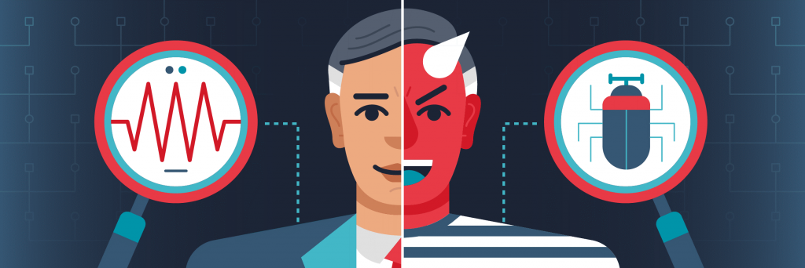

Bu yazımda Veri Gizliliği ve Güvenliği hakkında çeşitli detay, gereksinim ve istatistiklere yüzeysel olarak değineceğim. Gerçek bir sistemde bu ikisine de ihtiyaç duyuyoruz. Veri Gizliliği, genellikle veri koruma yasaları ve düzenlemeleri ile alakalıdır. Veriyi elde etmek, işlemek, paylaşmak, arşivlemek veya silmek bu kapsama girer. Fakat Veri Güvenliği genellikle, veriyi çeşitli saldırılara karşı savunma ve güvenliğini sağlamayla alakalıdır.

## Veri Gizliliği

 

Kısaca bir kişinin kendi verilerine ne olacağının kontrolünde olabilmesidir denilebilir.

### GDPR ve CCPA

 

Veri gizliliği ile alakalı 2 ünlü düzenleme var. Bunlardan biri GDPR, öteki ise CCPA.

GDPR, teriminin açılımı Genel Veri Koruma Düzenlemesi (General Data Protection Regulation)’dir: Veri güvenliği ve gizliliği ile alakalı bir Avrupa Birliği yasal düzenlemesidir. Avrupa’daki sunucuları veya Avrupa’lılara hizmet veren sunucuları kapsar. Mayıs 2018 yılından beri uygulanmaktadır.

CCPA, teriminin açılımı Kaliforniya Tüketici Gizliliği Kanunu(California Consumer Privacy Act)’dur. Kaliforniya Eyaleti tarafından tanınır. CCPA, Ocak 2020’den beri uygulanmaktadır, yani bu yazıyı yazdığım tarihe göre oldukça yeni bir düzenlemedir.

### Şeffaflığın Önemi

Günümüzde bir şirketin gerçek değeri, elde ettiği müşteri verilerinde yatıyor. Gizlilik yasaları, unutulma hakkı gibi hakların sağlanması ve şahsın kendi verisini geri alabilmesini sağlar. Yani, bir şirket müşterisinin güvenini kazanmak için şeffaf olmalı ve müşterisinin verisine ne olduğunu bildirmelidir.

### Bazı Veri Gizliliği Davaları

Örneklerimizden biri British Airways. 2019 yılında site trafiğinin bir hacker web sitesine yönlendirilmesi sonucu 500.000 müşterinin kişisel verisini kaptırdırlar. ICO’ tarafından 204 Milyon € cezaya çarptırıldılar.

Bir başka örnek ise Mariott International’dan. 2019 yılında bir siber saldırı sonucu 339 Milyon ziyaretçi kaydı çalındı. ICO tarafından 110 Milyon € cezalandırlıdılar.

Son örnek olarak Google’dan bahsedeceğim. 2019 yılında Fransız Veri Koruma Kurumu tarafından verilerin toplanması konusunda şeffaflık eksikliği, reklam hedefleme, veri işleme kanunsuzluğu konularından dolayı 50 Milyon € cezaya çarptırıldılar.

## Veri Güvenliği

Veri Güvenliği, temel olarak veri tabanını, içerdiği veriyi, yönetim sistemini, fiziksel veya sanal sunucu/donanımı ve veri tabanına erişim sağlayan uygulamaları kapsayan güvenlik kontrolleri terimidir.

### Genel Tehdit ve Kontroller

3 genel tehdit tipi vardır:

**Bütünlüğün Kaybolması:** Eğer yetkilendirilmemiş biri CRUD (Create, Read, Update, Delete) yöntemlerini kullanabiliyorsa, sistem kusurludur.

**Ulaşılabilirliğin Kaybolması:**  Sistem kullanıcısının ulaşmak istediği, erişim hakkı olan veriye ulaşamamasıdır.

**Gizliliğin Kaybolması:** Eğer özel bir veri varsa, uygun haklara sahip kişilerle paylaşılmaması veya uygun haklara sahip olmayan kişilerle paylaşılıyor olmasıdır.

Tehditlere karşı 4 genel çözüm vardır:

**Erişim Kontrolü:** Veritabanı güvenlik mekanizması erişimi sınırlandırmalıdır.

**Çıkarım Kontrolü:** Bazı sorgulardan çıkarım yapma yoluyla şahıslar hakkında bilgiler elde edilebilir. Erişim sağlanan verinin çıkarım yapılabilecek veri olup olmadığını kontrol etmeliyiz. Bu genellikle istatistiksel veritabanları için göz önünde bulundurulur.

**Akış Kontrolü:** Veri akışının yetkisi olmayan kullanıcılara ulaşıp ulaşmadığını kontrol etmeliyiz.

**Şifreleme:** Hassas veriler için şifreleme algoritmaları kullanmalıyız.

### Tehditler Hakkında Biraz Daha Derine İnelim

### **İç Tehditler**

İç tehditler ayrıcalıklı erişim hakkı olan aktörlerden gelen güvenlik tehdididir.

İç tehditler içeriden sisteme zarar vermek isteyen kişiler, dikkatsizlikten dolayı sisteme zarar veren kişiler veya ayrıcalıklı olan veya ayrıcalıklı bir hesabı çalmış olan (phising) hackerlar tarafından gerçekleştirilen en yaygın tehditlerden biridir.

**Phising:** Sizi genellikle bir adrese yönlendirip, çeşitli yöntemlerle sizden veri çalan saldırı yöntemidir.

Buna genel bir çözüm olarak çok fazla kişiye yetkili hesaplar vermemeliyiz, aynı zamanda herkese yetkisi bazında yeterli eğitimi sağlamalıyız, siber tehditlere karşı kişileri bilgilendirmeliyiz.

#### İnsan Hataları

Genellikle güçsüz şifreler, şifre paylaşma veya bunun gibi diğer bilgi eksikliği temelli hatalardır. Tüm veri sızıntılarının %49’u insan hatasıdır.

#### Veritabanı Yazılımının Zayıflıklarının Ortaya Çıkması

Hacker’lar genellikle bilindik veritabanı yazılımlarını hedef alır bu yazılımların halihazırda ortaya çıkarılmış açıklarından faydalanırlar. Bu durumda her zaman veritabanı yazılımımızın güncel olması gerektiğini söyleyebiliriz.

#### SQL/NoSQL İnjeksiyon Saldırıları

Veritabanı özelinde SQL veya NoSQL saldırı komutlarını web uygulamaları veya HTTP bağlantıları tarafından çalıştırılan veritabanı sorguları arasına yerleştirme işlemidir. Güvenli uygulama programlama yöntemlerini takip etmemek ve düzenli zafiyet testleri uygulamamak sisteminizi bu tarz saldırılara açık hale getirebilir.

#### Buffer Overflow Zafiyeti

Bir işlem belirli boyutlu bir hafıza blokuna fazlaca veri yazmaya kalkıştığında karşılaşılan açıktır. Saldırganlar bu açıktan faydalanarak kendi kodlarını sunucuda çalıştırabilmektedir.

 

#### Hizmet Reddi (DOS/DDOS) Saldırıları

Saldırganlar, fazlaca taleple hedef sunucuyu bombalarlar, bu durumda sunucu, çok fazla talep aldığı için gerçek kullanıcıların taleplerini karşılayamayacak hale gelir. Bu tarz durumlar için ara broker yazılımları kullanabilirsiniz.

#### Malware

Malware’ler hedef sunucuların açıklarını ortaya çıkarma veya direkt zarar verme amacıyla programlanmış yazılımlardır. Malware sunucu ağına doğrudan bağlı bir uç cihazdan bulaşabilir.

 

#### Yedek Hedefli Saldırılar

Hacker'ların bir kısmı kendilerine hedef olarak yedek verisini seçerler, yedeklerin iyi korunduğundan emin olunmalıdır.

#### Bazı İlginç Bilgiler

2018 yılında ilk defa bir DDoS saldırısı 1Tbps boyuta ulaştı, birkaç gün sonra 1.7 Tbps ile bu boyut aşıldı. (NetScout, 2019)

2018 yılı boyunca Phising saldırıları %250 oranında arttı. (SANS, 2019)

Sızıntı başına ortalama 6.45 Milyon $ ile, sağlık endüstrisi en büyük ortalama sızıntı maliyeti olan endüstridir. (Ponemon, 2019)

İnternet'te her üç kişiden ikisinin kayıtları kötü amaçlı taraflar tarafından çalınmıştır. (CSIS, 2018)

Eğer bir bulut migrasyonu (aktarım) esnasında sızıntı yaşanırsa, sızıntı başına maliyet 300.000 $ bandına yükselmiştir. (Ponemon, 2019)

#### Gelecekte Ne Olacak?

Veri hacimleri eksponansiyel olarak büyüyorlar. Bundan dolayı veri güvenliği araçları veya yöntemleri ölçeklenebilir olmalıdır.

Ağ ortamları gittikçe karmaşıklaşıyor, eğer bir de sistemler iş yükünü multicloud veya hybridcloudlara aktarıyorsa, dağıtım yöntemini seçmek ve güvenliği sağlamak gittikçe zorlaşıyor.

Yasal düzenlemeler artıyor ve daha kısıtlayıcı hale geliyorlar.

Uzmanların tahminine göre 2022 tarihine kadar 8 milyon doldurulmamış siber güvenlik pozisyonu olacak.

**Not:** Güvenlik kontrolleri, güvenlik farkındalığı eğitim programları, penetraston testleri ve zafiyet stratejileri resmi güvenlik politikanızda mutlaka bulunmalıdır.

#### Veri Koruma Araçları ve Platformları

Tam ölçekte bir çözüm aşağıdaki yetilere sahip olmalıdır:

**Keşif:** Veri tabanlarınızı tarayıp, zafiyetlerini sınıflandırılabilen bir araç bulun. Bu araç bulunan zafiyetler hakkında öneriler sunabilmelidir.

**Veri Aktivitesi Görüntüleme:** Veri tabanlarınızdaki veri aktivitesini görüntüleme, denetleme ve raporlama yetisine sahip bir araç bulun. Bu araç gerçek zamanlı olarak şüpheli aktivitelerde sizi uyarabilmelidir. Bu araç aynı zamanda kural uygulama ve görev ayırımı yapabilmelidir.

**Şifreleme ve Tokenization Yetisi:** Bir sızıntı yaşandığında, şifreleme son savunma noktasıdır. Seçeceğiniz araç tokenization(veri maskeleme) isteyebilecek dosyalama, veri ve uygulama şifreleme yetilerine, aynı zamanda gelişmiş güvenlik anahtarı yönetimi yetilerine sahip olmalıdır.

**Veri Güvenliği Optimizasyonu ve Risk Analizi:** Veri güvenliği bilgisi ile gelişmiş analitiği kombine eden, size optimizasyon, risk analizi ve raporlama özellikleri sunan bir araç bulun.
