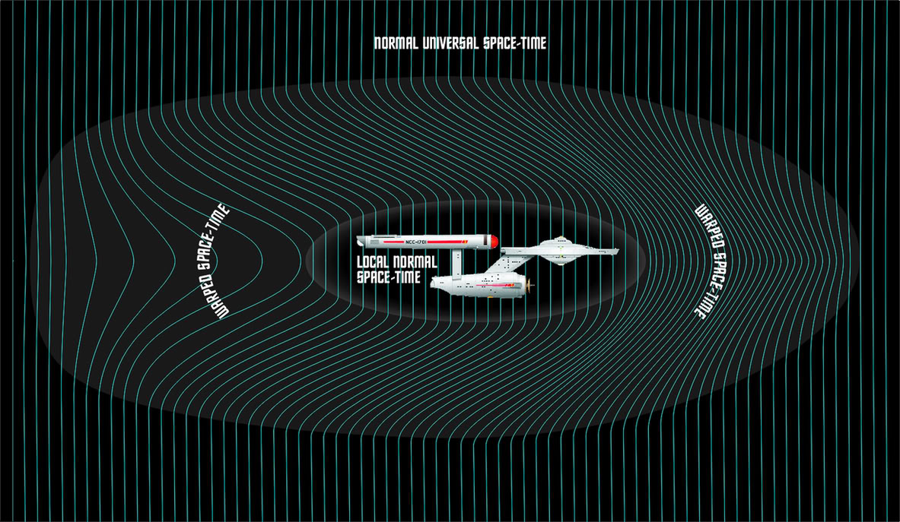

Değil Gözlemlenebilir Evren, değil Galaksiler, yalnızca yıldızlararası boşluklar dahi insan beyninin kavramakta zorlanacağı devasa mesafelere sahip. Güneş Sistemi dışında ulaşılabilecek en yakın yıldız sistemi olan Alfa Centauri yaklaşık 4 ışıkyılı uzaklıkta. Bu demek oluyor ki ışık hızıyla yapılan bir seyahat ile ancak 4 yılda o yıldıza ulaşılabilecek.

Gelgelelim insanoğlunun ışık hızına ulaşması bugünün bilimine göre mümkün değil. Işık hızına ulaşabilmek için enerjiye dönüşmek gerekir. Bir maddeyi gitgide ışık hızına yaklaştırdıkça o maddenin kütlesi Albert Einstein'ın denklemlerine göre hızla artar. Işık hızına ulaşıldığında ise maddeye sonsuz bir enerji sağlamak, sonsuz bir kuvvet uygulamak gerekir. İnsanlığın bugün o yıldız sistemi konusunda gerçekleştirebileceği tek eylem elektromanyetik dalgalarla mesaj yollamak olabilir. Bu radyo dalgaları olabilir, görülebilir ışık olabilir,  fakat madde olamaz. [Fermi Paradoksu](http://sabahlatan.com/blog/dunya-disi-yasam-ve-fermi-paradoksu/)'na göre de bu yüzden evrendeki diğer medeniyetleri keşfetmek mümkün olmayacak.

Tüm bu nedenlerden dolayı insnaoğlu yıldızlararası seyahat konusunda farklı kurgular üzerinde duruyor. Bunlardan en bilinenlerinden biri de Warp Drive teknolojisi. Hiç ışık hızı olaylarına girmeden, evrenin dokusu üzerinde oynama yaparak evrenin uzak köşelerine gitme fikrini barındıran kurgusal bir cihaz. Şimdilik bilimkurgu senaryosu gibi görünse de, evrenin üzerinde oynanabilir dokusu düşünüldüğünde imkansız bir fikir değil. İnsanoğlu evrende nadiren gerçekleşen olayları gerçekleştirebiliyor, ve daha fazlasını da gerçekleştirebilir. Çünkü evrende her şey kaotik olarak gelişir; fakat bilim insanları hesaplayarak, bir düzen ve sıra içerisinde sonuca ulaşmaya çalışır.

Bu teknolojiye ulaşılırsa ışık hızından daha yüksek hızda seyahat etmek mümkün hale gelecek. Çünkü ışık hızı evrenin kendi içindeki olgulara koyduğu bir limittir.  Evrenin kendisi ışık hızından daha hızlı genişler. Bu yüzden gökyüzü gece karanlıktır ve bu yüzden Gözlemlenebilir Evren diye bir kavram var. Gözlemlenebilir Evren'in dışındaki gökcisimlerinin ışığı evrenin ışık hızından yüksek hızlarda, daha da hızlanarak genişlemesi nedeniyle Dünya'ya bugüne kadar ulaşamadı.

Warp motorunun çalışma prensibi, uzay gemisinin önünde bir çekim alanı yaratacak şekilde bir büküm, arkasında ise uzay gemisini itecek başka bir alan şeklinde ters yönde bir büküm yaratmaya dayanıyor. Uzay gemisinin önünde uzayzaman sıkıştırılır, arkasında ise gerilir. Dolayısıyla gemi kendi itiş gücünü kullanmak yerine bu oluşturulan alan içerisinde yüzerek mesafe kat edecektir. Warp teknolojisinin önündeki en büyük engellerin başında ise gerekli enerjiyi sağlamak geliyor. Bu kurgusal teknoloji enerji tüketimi konusunda aşırı masraflı. Tahmin edilebileceği üzere bu etkileri yaratabilecek bir cihaz için muazzam güçte bir enerji gerekiyor.
